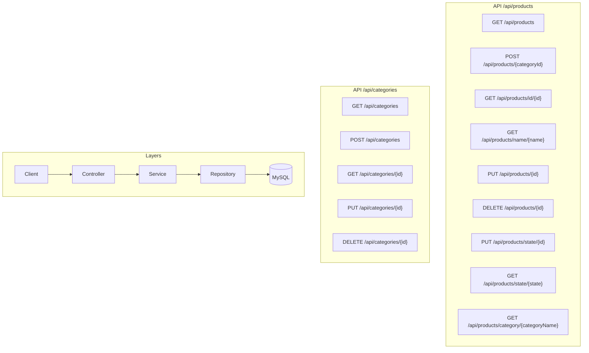

# Skill: api-concept-map

Auto-generate a conceptual map of all API endpoints from `@RestController` classes and insert it into the README.

## When to use

After adding, removing, or modifying REST controllers — or when the README concept map section is stale.

## What it does

1. Scans all files under `src/main/java/**/controller/` for `@RestController` annotations
2. For each controller, extracts:
   - `@RequestMapping` base path
   - Each endpoint method with `@GetMapping`, `@PostMapping`, `@PutMapping`, `@DeleteMapping`, `@PatchMapping`
   - Full path (base + method-level mapping)
   - HTTP method
   - Parameters (`@PathVariable`, `@RequestParam`, `@RequestBody`)
   - Return type
   - A brief description derived from the method name or Javadoc
3. Generates a Mermaid `flowchart LR` or `graph TD` diagram showing the request flow: Client → Controller → Service → Repository
4. Inserts the diagram into `README.md` between the marker comments:

   - English section: `<!-- API_CONCEPT_MAP_EN:START --> ... <!-- API_CONCEPT_MAP_EN:END -->`
   - Spanish section: `<!-- API_CONCEPT_MAP_ES:START --> ... <!-- API_CONCEPT_MAP_ES:END -->`

## Output format

### English
```markdown
<!-- API_CONCEPT_MAP_EN:START -->

<!-- API_CONCEPT_MAP_EN:END -->
```

### Spanish
Same diagram, but between `<!-- API_CONCEPT_MAP_ES:START -->` and `<!-- API_CONCEPT_MAP_ES:END -->` with labels in Spanish.

## Rules

- Do NOT modify any content outside the marker comments
- Do NOT create additional files — only update `README.md`
- Organize endpoints by controller/resource group (subgraphs)
- Include the layer flow diagram (Client → Controller → Service → Repository → Database)
- Verify the Mermaid syntax is valid before writing
- Run `mvn test` after updating to ensure nothing is broken
