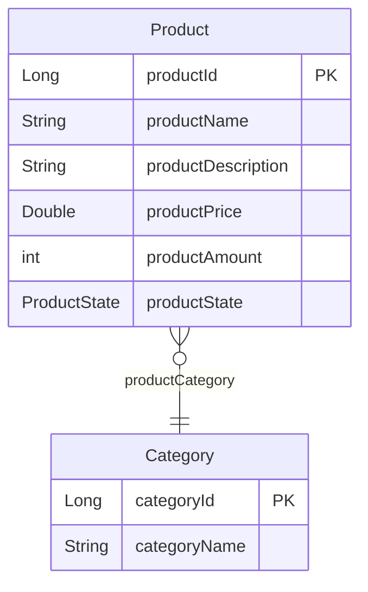

# Skill: entity-mapper

Auto-generate entity relationship diagrams in markdown from `@Entity` classes and insert them into the README.

## When to use

After adding, removing, or modifying JPA entities — or when the README diagram section is stale.

## What it does

1. Scans all files under `src/main/java/**/entity/` for `@Entity` annotations
2. For each entity, extracts:
   - Table name (or class name as fallback)
   - All columns with their Java types and JPA annotations
   - Primary key field (`@Id`)
   - Relationships (`@ManyToOne`, `@OneToMany`, `@OneToOne`, `@JoinColumn`)
   - Enum fields (`@Enumerated`)
3. Generates a markdown Entity Relationship Diagram using Mermaid `erDiagram` syntax
4. Inserts the diagram into `README.md` between the marker comments:

   - English section: `<!-- ENTITY_DIAGRAM_EN:START --> ... <!-- ENTITY_DIAGRAM_EN:END -->`
   - Spanish section: `<!-- ENTITY_DIAGRAM_ES:START --> ... <!-- ENTITY_DIAGRAM_ES:END -->`

## Output format

### English
```markdown
<!-- ENTITY_DIAGRAM_EN:START -->

<!-- ENTITY_DIAGRAM_EN:END -->
```

### Spanish
Same content, but between `<!-- ENTITY_DIAGRAM_ES:START -->` and `<!-- ENTITY_DIAGRAM_ES:END -->` with Spanish labels.

## Rules

- Do NOT modify any content outside the marker comments
- Do NOT create additional files — only update `README.md`
- Use `@Column(name = "...")` for the field label when present, otherwise use the Java field name
- For `@Enumerated(EnumType.STRING)` fields, mark the type as the enum name
- For relationships, include the cardinality: `||--||` (one-to-one), `||--o{` (one-to-many), `}o--||` (many-to-one), `}o--o{` (many-to-many)
- Verify the Mermaid syntax is valid before writing
- Run `mvn test` after updating to ensure nothing is broken
