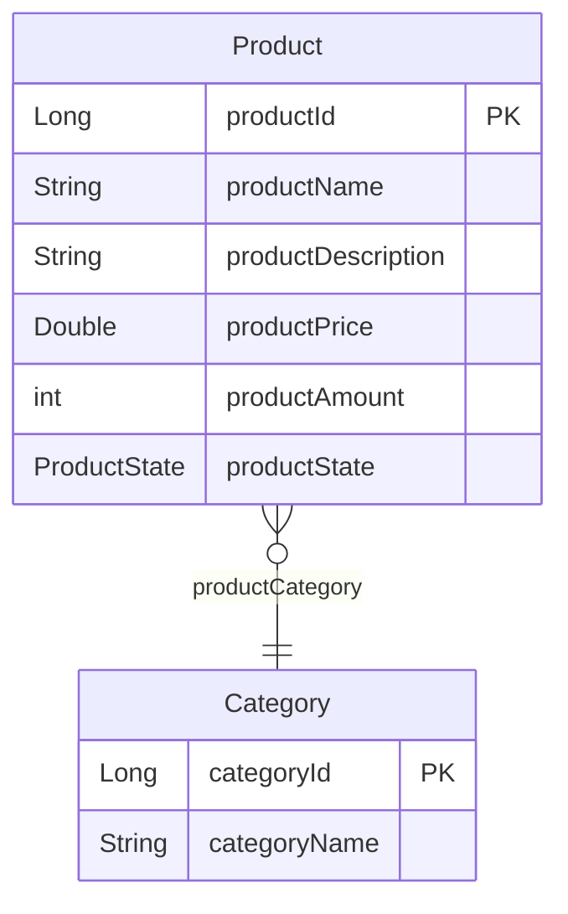
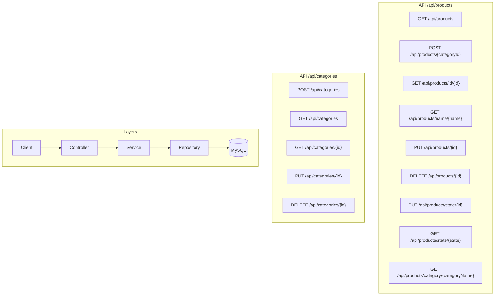
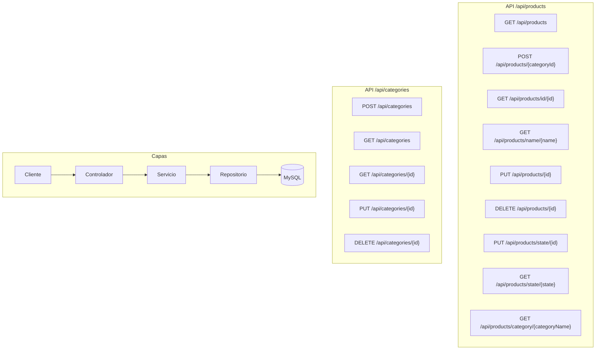

# 📚 Biblioteca API

[**English**](#english) · [**Español**](#español)

---

> RESTful API for product and category catalog management. Built with Spring Boot, following clean architecture principles and REST best practices.
>
> API RESTful para la gestión de un catálogo de productos y categorías. Construida con Spring Boot, siguiendo principios de arquitectura limpia y mejores prácticas REST.

---

## <a id="english"></a>🇬🇧 English

### Description

Biblioteca API is a portfolio project that demonstrates a clean, layered REST API architecture. It manages **Products** (with name, description, price, amount, and availability state) organized into **Categories**. The project showcases:

- Layered architecture (Controller → Service → Repository)
- DTO separation from JPA entities
- Centralized exception handling
- Input validation
- Automated testing with MockMvc
- OpenAPI documentation
- Clean code conventions

### Stack

| Technology | Version |
|---|---|
| Java | 17 |
| Spring Boot | 4.1.0 |
| Spring Data JPA + Hibernate | — |
| MySQL | 8.0 |
| Maven | — |
| ModelMapper | 3.2.6 |
| Lombok | — |
| SpringDoc OpenAPI | 2.6.0 |
| JUnit 5 + MockMvc + Mockito | — |

### Endpoints

| Method | Path | Description |
|---|---|---|
| `GET` | `/api/products` | List all products |
| `GET` | `/api/products/id/{id}` | Find product by ID |
| `GET` | `/api/products/name/{name}` | Find product by name |
| `GET` | `/api/products/state/{state}` | Find products by state |
| `GET` | `/api/products/category/{categoryName}` | Find products by category |
| `POST` | `/api/products/{categoryId}` | Register a new product in a category |
| `PUT` | `/api/products/{id}` | Update a product |
| `PUT` | `/api/products/state/{id}` | Change product state |
| `DELETE` | `/api/products/{id}` | Delete a product |
| `GET` | `/api/categories` | List all categories |
| `GET` | `/api/categories/{id}` | Find category by ID |
| `POST` | `/api/categories` | Create a new category |
| `PUT` | `/api/categories/{id}` | Update a category |
| `DELETE` | `/api/categories/{id}` | Delete a category |

### Swagger UI

Once the server is running, visit:

```
http://localhost:${PORT}/swagger-ui/index.html
http://localhost:${PORT}/v3/api-docs
```

(The exact port and paths are printed in the console on startup.)

### Quick Start

```bash
# 1. Copy environment template
cp example.env .env
# 2. Edit .env with your MySQL credentials
# 3. Run the application
mvn spring-boot:run
# 4. Run tests
mvn test
```

### Entity Relationship Diagram

<!-- ENTITY_DIAGRAM_EN:START -->

<!-- ENTITY_DIAGRAM_EN:END -->

### API Concept Map

<!-- API_CONCEPT_MAP_EN:START -->

<!-- API_CONCEPT_MAP_EN:END -->

### AI-Assisted Development

This project was developed using **OpenCode**, an AI-first code agent, as a productivity multiplier. The approach follows software engineering best practices with AI:

- **AGENTS.md (Harness Engineering)**: A persistent system prompt defining stack, conventions, structure, and inviolable rules for the AI agent
- **Skills**: Modular internal knowledge files (`.opencode/skills/`) that the agent loads on demand for specific tasks
- **Structured Prompt Engineering**: All AI interactions follow a 5-axis framework: Role, Context, Task, Constraints, Output Format
- **Verification Loop**: Iterative cycle of write → test → correct, with human supervision at every step

> *"AI executes, but the project owner is you."*

AI is used for repetitive tasks (test generation, code audits, refactoring), while architectural decisions remain under human control.

---

## <a id="español"></a>🇪🇸 Español

### Descripción

Biblioteca API es un proyecto de portafolio que demuestra una arquitectura REST limpia y en capas. Gestiona **Productos** (con nombre, descripción, precio, cantidad y estado de disponibilidad) organizados en **Categorías**. El proyecto muestra:

- Arquitectura en capas (Controller → Service → Repository)
- Separación de DTOs de las entidades JPA
- Manejo centralizado de excepciones
- Validación de entrada
- Tests automatizados con MockMvc
- Documentación OpenAPI
- Convenciones de código limpio

### Tecnologías

| Tecnología | Versión |
|---|---|
| Java | 17 |
| Spring Boot | 4.1.0 |
| Spring Data JPA + Hibernate | — |
| MySQL | 8.0 |
| Maven | — |
| ModelMapper | 3.2.6 |
| Lombok | — |
| SpringDoc OpenAPI | 2.6.0 |
| JUnit 5 + MockMvc + Mockito | — |

### Endpoints

| Método | Ruta | Descripción |
|---|---|---|
| `GET` | `/api/products` | Listar todos los productos |
| `GET` | `/api/products/id/{id}` | Buscar producto por ID |
| `GET` | `/api/products/name/{name}` | Buscar producto por nombre |
| `GET` | `/api/products/state/{state}` | Buscar productos por estado |
| `GET` | `/api/products/category/{categoryName}` | Buscar productos por categoría |
| `POST` | `/api/products/{categoryId}` | Registrar un nuevo producto en una categoría |
| `PUT` | `/api/products/{id}` | Actualizar un producto |
| `PUT` | `/api/products/state/{id}` | Cambiar estado de un producto |
| `DELETE` | `/api/products/{id}` | Eliminar un producto |
| `GET` | `/api/categories` | Listar todas las categorías |
| `GET` | `/api/categories/{id}` | Buscar categoría por ID |
| `POST` | `/api/categories` | Crear una nueva categoría |
| `PUT` | `/api/categories/{id}` | Actualizar una categoría |
| `DELETE` | `/api/categories/{id}` | Eliminar una categoría |

### Swagger UI

Una vez que el servidor esté en ejecución, visita:

```
http://localhost:${PORT}/swagger-ui/index.html
http://localhost:${PORT}/v3/api-docs
```

(Los valores exactos de puerto y rutas se muestran en la consola al iniciar.)

### Inicio Rápido

```bash
# 1. Copiar plantilla de entorno
cp example.env .env
# 2. Editar .env con tus credenciales de MySQL
# 3. Ejecutar la aplicación
mvn spring-boot:run
# 4. Ejecutar tests
mvn test
```

### Diagrama Entidad-Relación

<!-- ENTITY_DIAGRAM_ES:START -->

<!-- ENTITY_DIAGRAM_ES:END -->

### Mapa Conceptual de la API

<!-- API_CONCEPT_MAP_ES:START -->

<!-- API_CONCEPT_MAP_ES:END -->

### Desarrollo Asistido por IA

Este proyecto ha sido desarrollado utilizando **OpenCode**, un agente de código AI-first, como herramienta de productividad. El enfoque sigue principios de ingeniería de software con IA:

- **AGENTS.md (Harness Engineering)**: Archivo de configuración que actúa como system prompt persistente del proyecto, definiendo stack, convenciones, estructura y reglas inquebrantables para el agente
- **Skills**: Conocimiento interno modular (archivos `.opencode/skills/`) que el agente carga solo cuando necesita
- **Prompt Engineering estructurado**: Todas las interacciones siguen el framework de 5 ejes: Rol, Contexto, Tarea, Restricciones y Formato de salida
- **Bucle de verificación**: Ciclo iterativo de escribir → testear → corregir, con supervisión humana en cada paso

> *"La IA ejecuta, pero el responsable del proyecto eres tú."*

La IA se utiliza para tareas repetitivas (generación de tests, auditorías de código, refactorizaciones), mientras que las decisiones arquitectónicas permanecen bajo control humano.
